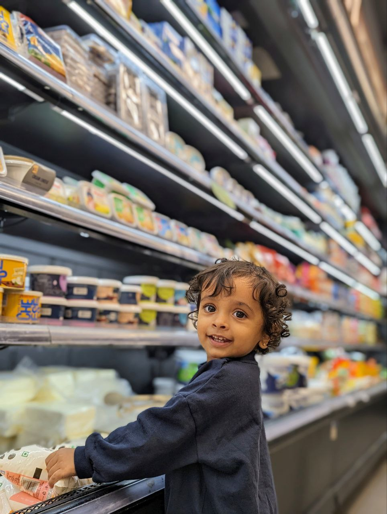

# Alwin's Modern Gallery

  

Welcome to **Alwin’s Modern Gallery**, a curated digital space showcasing moments, moods, and memories—crafted through my lens and creativity. Each frame reflects emotion, light, and personal stories from my journey.

> ✨ **“Frames of Pixel Bloom”** – A collection that celebrates the subtle beauty in everyday life.

---

## 🖼️ Live Preview

🎯 **If you want to see my gallery, click the image above!**

---

## 📁 Project Structure

Alwins-modern-gallery/

│

├── index.html # Main HTML file

├── styles.css # Gallery styling

├── logo/ # Backgrounds and banners

├── gallery/ # All gallery images

└── README.md # You're here

---

## 🛠️ Built With

- ✅ HTML5  
- ✅ CSS3  
- ✅ Responsive Design  
- ✅ Tailwind-Inspired Aesthetic  
- ✅ Minimal Layout

---

## 💡 Features

- 🌆 Full-screen photo layout  
- 🎨 Custom background support  
- ✨ Clean & modern design  
- 📱 Fully mobile-friendly  

---

## 📸 About the Gallery

This is more than just a photo site—it's a window into the memories I hold close.  
I won’t say my photos are the best in the world, but I believe every frame tells a story.

---

## 📬 Connect with Me

  

---

  

> 🧠 *“Photography is the story I fail to put into words.”*
